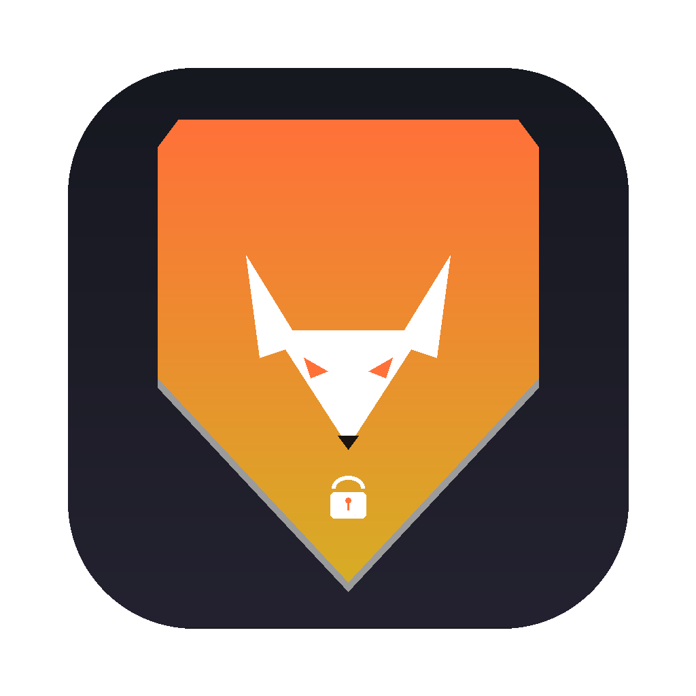

<div align="center">

# 🦊 Vulpine

### Unofficial Firefox VPN Client for macOS
### کلاینت غیررسمی فایرفاکس وی‌پی‌ان برای سیستم‌عامل مک

<p align="center">
  
</p>


<br>

**[English](#-english)** • **[فارسی](#-فارسی)**

</div>

<br>

---

## 🇬🇧 English

### Overview

**Vulpine** is a native, subscription-free macOS client for Firefox VPN. It signs in with your existing Firefox account, obtains an official proxy pass from Mozilla's **Guardian** service, and tunnels network traffic through Firefox VPN's Fastly edge servers across a persistent, multiplexed **HTTP/2 tunnel**.

It is a complete, from-scratch macOS port of [FoxyVPN](https://github.com/Vauth/FoxyVPN) (which targeted Android), re-architected in pure **Swift 5.9** and **SwiftUI** using Apple's modern frameworks (`Network.framework`, `Security.framework` / Keychain, `Combine`, and `SystemConfiguration`).

> [!NOTE]
> **No subscription required.** Vulpine runs on the free **50 GB monthly VPN allowance** that Mozilla bundles with standard Firefox accounts. Traffic resets automatically every month.

### 🌟 Features

- **Native macOS Experience:** Built exclusively with SwiftUI and AppKit. Fits right into macOS Ventura, Sonoma, and Sequoia with Dark and Light mode support.
- **Menu Bar Companion:** Live status indicator in the macOS menu bar with instant Connect/Disconnect toggling without opening the main window.
- **Direct HTTP/2 Multiplexed Tunnel:** Zero external runtime dependencies. Implements RFC 9113 HTTP/2 framing and RFC 7541 HPACK header compression natively over Apple's `Network.framework` with ALPN `h2`.
- **Fastly Edge Integration:** Carries all outbound TCP streams over `CONNECT` requests authenticated with Mozilla Guardian bearer tokens.
- **Local SOCKS5 Bridge:** High-performance local SOCKS5 server listening on `127.0.0.1:10808` (configurable), allowing system-wide routing or proxying specific apps (browsers, Telegram, terminals).
- **macOS System Proxy Automation:** Optional 1-click **Proxy-Only Mode** automatically applies and removes system SOCKS settings via `networksetup`.
- **Mozilla Remote Settings Server List:** Dynamically pulls the official, up-to-date catalog of Firefox VPN exit nodes across dozens of countries and cities.
- **Secure Keychain Storage:** Session tokens and authentication keys are stored exclusively in the macOS Keychain (`Security.framework`). No plain-text files.
- **Two-Factor Authentication (2FA):** Full support for Firefox email confirmation codes during sign-in.
- **Live Throughput Statistics:** Real-time upload and download rate meters (KB/s, MB/s) with a 2,000-entry in-app diagnostic log viewer.

### 📋 Requirements

- **macOS 13.0 (Ventura)** or newer (compatible with macOS 14 Sonoma and macOS 15 Sequoia)
- Apple Silicon (M1/M2/M3/M4) or Intel Mac
- Free [Firefox Account](https://accounts.firefox.com/signup)

### 🚀 Getting Started

#### Option 1: Build from Source with Swift PM

```bash
# 1. Clone the repository
git clone https://github.com/HELBOYCODER/Vulpine.git
cd Vulpine

# 2. Build the release binary and bundle
make build

# 3. Launch the app
open build/Vulpine.app
```

#### Option 2: Swift Run (Development)

```bash
swift run Vulpine
```

### ⚙️ How It Works

```
┌────────────────────────────────────────────────────────┐
│                     Vulpine (macOS)                    │
│                                                        │
│  [Firefox Account] ──(PBKDF2/Hawk)──► [Mozilla FxA]    │
│                                            │           │
│  [Guardian Client] ◄──(Bearer Pass)────────┘           │
│         │                                              │
│  [Local SOCKS5] ◄─── macOS Apps / System Traffic       │
│         │                                              │
│  [HTTP/2 Multiplexer (RFC 9113 + HPACK RFC 7541)]      │
│         │                                              │
└─────────┼──────────────────────────────────────────────┘
          │  TLS + ALPN "h2" (Network.framework)
          ▼
┌────────────────────────────────────────────────────────┐
│           Fastly Edge (Mozilla Firefox VPN)            │
│               Worldwide Exit Nodes                     │
└────────────────────────────────────────────────────────┘
```

---

## 🇮🇷 فارسی

### معرفی پروژه

**والپاین (Vulpine)** یک کلاینت بومی، کاملاً رایگان و بدون نیاز به اشتراک برای استفاده از سرویس **Firefox VPN** روی سیستم‌عامل **مک (macOS)** است. این برنامه با حساب کاربری فایرفاکس شما وارد شده، توکن مجاز رسمی را از سرویس **Guardian** موزیلا دریافت کرده و ترافیک شبکه را از طریق سرورهای لبه‌ی پرسرعت **Fastly** موزیلا روی یک تونل پایدار و مالتی‌پلکس‌شده‌ی **HTTP/2** عبور می‌دهد.

این پروژه بازنویسی و تبدیل کامل پروژه [FoxyVPN](https://github.com/Vauth/FoxyVPN) (که مخصوص اندروید بود) برای مک است که به صورت بومی و از پایه با زبان **Swift 5.9** و رابط کاربری مدرن **SwiftUI** همراه با فریم‌ورک‌های استاندارد اپل پیاده‌سازی شده است.

> [!NOTE]
> **کاملاً رایگان و بدون نیاز به اشتراک پولی.** این کلاینت از سهمیه ۵۰ گیگابایت ترافیک ماهانه‌ی رایگانی که موزیلا روی هر اکانت فایرفاکس ارائه می‌دهد استفاده می‌کند و هر ماه به صورت خودکار تمدید می‌شود.

### 🌟 قابلیت‌های کلیدی

- **طراحی کاملاً بومی برای مک:** ساخته‌شده به طور اختصاصی با SwiftUI و هماهنگ با طراحی مدرن macOS Ventura، Sonoma و Sequoia، همراه با پشتیبانی کامل از تم روشن (Light) و تاریک (Dark).
- **آیکون کنترل در Menu Bar مک:** امکان مشاهده وضعیت اتصال و قطع/وصل سریع از منوبار بالای مک بدون نیاز به باز کردن پنجره اصلی.
- **موتور تونل اختصاصی HTTP/2:** بدون هیچ پیش‌نیاز یا وابستگی خارجی سنگین؛ پیاده‌سازی بومی فریم‌های RFC 9113 و فشرده‌سازی هدر HPACK (RFC 7541) بر روی `Network.framework` اپل با ALPN بومی `h2`.
- **پل SOCKS5 محلی:** سرور SOCKS5 بومی روی آدرس `127.0.0.1:10808` با قابلیت تنظیم پورت برای تونل کردن کل ترافیک سیستم یا برنامه‌های خاص (مرورگرها، تلگرام، ترمینال و ...).
- **حالت خودکار پروکسی سیستم (Proxy-Only Mode):** اعمال و حذف خودکار تنظیمات پروکسی شبکه مک با یک کلیک از طریق ابزار سیستمی `networksetup`.
- **دریافت پویای سرورهای موزیلا:** اتصال مستقیم به سرویس Remote Settings فایرفاکس جهت دریافت تازه‌ترین فهرست سرورها در ده‌ها کشور و شهر مختلف دنیا.
- **ذخیره‌سازی امن در Keychain:** نگهداری توکن‌ها و نشست‌ها درون Keychain اختصاصی macOS با امنیت سخت‌افزاری، بدون ذخیره‌سازی متن خام در فایل‌ها.
- **پشتیبانی از ورود دومرحله‌ای (2FA):** پشتیبانی کامل از کدهای تایید ایمیلی فایرفاکس هنگام ورود به حساب.
- **آمار لحظه‌ای ترافیک:** نمایش سرعت دانلود و آپلود لحظه‌ای به همراه پنجره عیب‌یابی و لاگ‌های زنده برنامه با ظرفیت ۲۰۰۰ رکورد.

### 📋 پیش‌نیازها

- **سیستم‌عامل مک نسخه ۱۳.۰ (Ventura) یا جدیدتر** (سازگار با macOS 14 Sonoma و macOS 15 Sequoia)
- پردازنده‌های Apple Silicon (M1 تا M4) یا پردازنده‌های Intel
- یک حساب کاربری رایگان در [accounts.firefox.com](https://accounts.firefox.com/signup)

### 🚀 نحوه راه‌اندازی و استفاده

#### روش اول: کامپایل و اجرای خودکار با Make

```bash
# ۱. دریافت ریپازیتوری
git clone https://github.com/HELBOYCODER/Vulpine.git
cd Vulpine

# ۲. بیلد و ساخت فایل برنامه
make build

# ۳. اجرای برنامه
open build/Vulpine.app
```

#### روش دوم: اجرا از طریق ترمینال (Swift PM)

```bash
swift run Vulpine
```

### 📖 راهنمای گام به گام استفاده

1. اگر حساب فایرفاکس ندارید، در [accounts.firefox.com](https://accounts.firefox.com/signup) به صورت رایگان ثبت‌نام کنید.
2. برنامه **Vulpine** را روی مک باز کنید.
3. ایمیل و پسورد حساب فایرفاکس خود را وارد کرده و در صورت فعال بودن کد تایید، کد ارسالی به ایمیل را وارد نمایید.
4. لوکیشن یا شهر مورد نظر خود را از لیست انتخاب کرده و دکمه اتصال مرکزی را بزنید.
5. ارتباط شما برقرار است و ترافیک با سرعت بالا و امنیت کامل ردوبدل می‌شود.

---

## ⚖️ License / لایسنس

This project is licensed under the [MIT License](LICENSE).

این پروژه تحت مجوز ام‌آی‌تی (MIT) منتشر شده است.

<br>

<div align="center">
  <b>Developed with ❤️ by <a href="https://github.com/HELBOYCODER">HELBOY</a></b>
</div>
